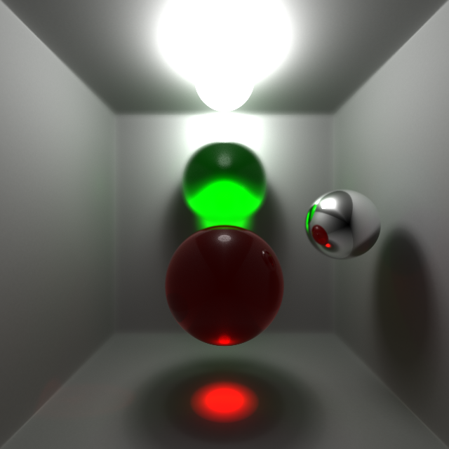
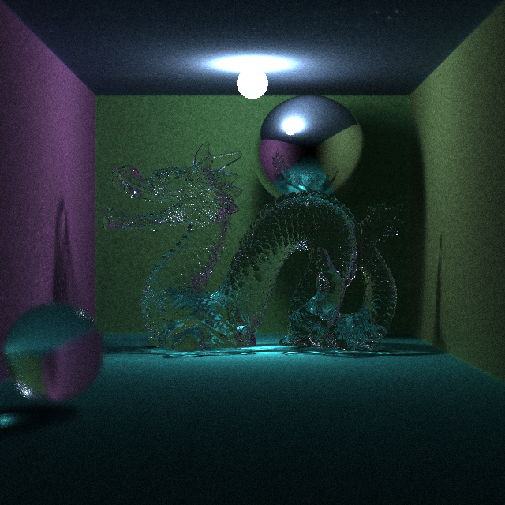

# NormalRender

A simple implementation of SSPM rander with BP model.

## Features

- Depth of field
- Caustics
- kD tree accelerated hit detection

## Results

- 2,000 iterations

- 80 iterations (2 million faces)

